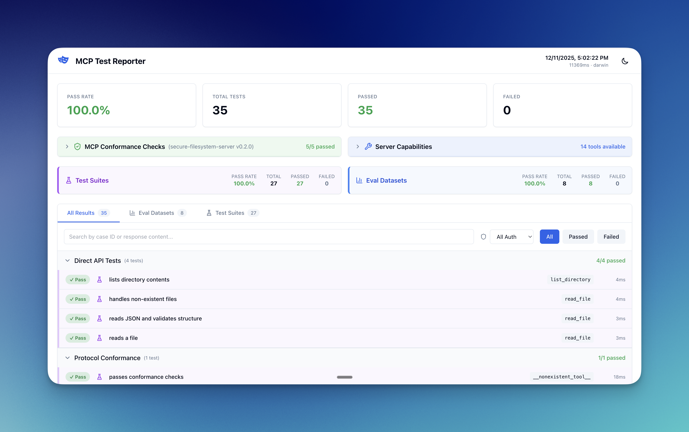

# @mcp-testing/server-tester

[](https://www.npmjs.com/package/@mcp-testing/server-tester)
[](https://github.com/mcp-testing/server-tester/actions/workflows/ci.yml)
[](https://opensource.org/licenses/MIT)
[](https://nodejs.org)
[](https://www.typescriptlang.org/)

> Playwright-based testing framework for MCP servers

> [!WARNING]
> **Experimental Project** - This library is in active development. APIs may change, and we welcome contributions, feedback, and collaboration as we evolve the framework. See [CONTRIBUTING.md](./CONTRIBUTING.md) for details.

`@mcp-testing/server-tester` is a comprehensive testing and evaluation framework for [Model Context Protocol (MCP)](https://modelcontextprotocol.io) servers. It provides first-class Playwright fixtures, data-driven eval datasets, and optional LLM-as-a-judge scoring.

## What's Included

This framework provides **two complementary approaches** for testing MCP servers:

### 1. **Automated Testing** (Playwright Tests)

Write deterministic, automated tests using standard Playwright patterns with MCP-specific fixtures. Perfect for:

- Direct tool calls with expected outputs
- Protocol conformance validation
- Integration testing with your MCP server
- CI/CD pipelines

```typescript
test('read a file', async ({ mcp }) => {
  const result = await mcp.callTool('read_file', { path: '/tmp/test.txt' });
  expect(result.content).toContain('Hello');
});
```

### 2. **Evaluation Datasets** (Evals) ⚠️ Experimental

Run deeper, more subjective analysis using dataset-driven evaluations. Includes:

- Schema validation (deterministic)
- Text and regex pattern matching (deterministic)
- LLM-as-a-judge scoring (non-deterministic)

**Note:** Evals, particularly those using LLM-as-a-judge, are highly experimental due to their non-deterministic nature. Results may vary between runs, and prompts may need tuning for your specific use case.

```typescript
const result = await runEvalDataset({ dataset, expectations }, { mcp });
expect(result.passed).toBe(result.total);
```

## Features

- 🎭 **Playwright Integration** - Use MCP servers in Playwright tests with idiomatic fixtures
- 📊 **Matrix Evals** - Run dataset-driven evaluations across multiple transports
- 🤖 **LLM-as-a-Judge** - Optional semantic evaluation using OpenAI or Anthropic
- 🔌 **Multiple Transports** - Support for both stdio (local) and HTTP (remote) connections
- ✅ **Protocol Conformance** - Built-in checks for MCP spec compliance

## Installation

```bash
npm install --save-dev @mcp-testing/server-tester @playwright/test zod
```

**Note:** Additional dependencies for LLM-as-a-judge are optional and only needed if you plan to use semantic evaluation:

```bash
# For OpenAI judge (optional)
npm install --save-dev openai @openai/agents

# For Anthropic judge (optional)
npm install --save-dev @anthropic-ai/sdk
```

## Quick Start

### Initialize with CLI

The fastest way to get started:

```bash
npx mcp-test init

# Follow the interactive prompts to create:
# - playwright.config.ts (configured for your MCP server)
# - tests/mcp.spec.ts (example tests)
# - data/example-dataset.json (sample eval dataset)
# - package.json (with all dependencies)
```

See the [CLI Guide](./docs/cli.md) for all options.

### Example: Testing in Action

Here's what a complete test suite looks like (following the **layered testing pattern**):

```typescript
// tests/mcp.spec.ts
import { test, expect } from '@mcp-testing/server-tester/fixtures/mcp';
import {
  loadEvalDataset,
  runEvalDataset,
  createSchemaExpectation,
} from '@mcp-testing/server-tester';
import { z } from 'zod';

// Layer 1: MCP Protocol Conformance
test.describe('MCP Protocol Conformance', () => {
  test('should return valid server info', async ({ mcp }) => {
    const info = mcp.getServerInfo();
    expect(info).toBeTruthy();
    expect(info?.name).toBeTruthy();
    expect(info?.version).toBeTruthy();
  });

  test('should list available tools', async ({ mcp }) => {
    const tools = await mcp.listTools();
    expect(Array.isArray(tools)).toBe(true);
    expect(tools.length).toBeGreaterThan(0);
  });

  test('should handle invalid tool gracefully', async ({ mcp }) => {
    const result = await mcp.callTool('nonexistent_tool', {});
    expect(result.isError).toBe(true);
  });
});

// Layer 2: Direct Tool Testing
test.describe('File Operations', () => {
  test('should read a file', async ({ mcp }) => {
    const result = await mcp.callTool('read_file', {
      path: '/tmp/test.txt',
    });
    expect(result.content).toContain('Hello');
  });
});

// Layer 3: Eval Datasets
test('file operations eval', async ({ mcp }) => {
  const FileContentSchema = z.object({
    content: z.string(),
  });

  const dataset = await loadEvalDataset('./data/evals.json', {
    schemas: { 'file-content': FileContentSchema },
  });

  const result = await runEvalDataset(
    {
      dataset,
      expectations: {
        schema: createSchemaExpectation(dataset),
      },
    },
    { mcp }
  );

  expect(result.passed).toBe(result.total);
});
```

```json
// data/evals.json
{
  "name": "file-ops",
  "cases": [
    {
      "id": "read-config",
      "toolName": "read_file",
      "args": { "path": "/tmp/config.json" },
      "expectedSchemaName": "file-content"
    },
    {
      "id": "read-readme",
      "toolName": "read_file",
      "args": { "path": "/tmp/README.md" },
      "expectedTextContains": ["# Welcome", "## Installation"]
    }
  ]
}
```

```typescript
// playwright.config.ts
import { defineConfig } from '@playwright/test';

export default defineConfig({
  testDir: './tests',
  projects: [
    {
      name: 'mcp-local',
      use: {
        mcpConfig: {
          transport: 'stdio',
          command: 'node',
          args: ['path/to/your/server.js'],
        },
      },
    },
  ],
});
```

## Documentation

- **[Quick Start Guide](./docs/quickstart.md)** - Detailed setup and configuration
- **[Expectations](./docs/expectations.md)** - All validation types (exact, schema, regex, text contains, LLM judge)
- **[API Reference](./docs/api-reference.md)** - Complete API documentation
- **[CLI Commands](./docs/cli.md)** - `init` and `generate` command details
- **[UI Reporter](./docs/ui-reporter.md)** - Interactive web UI for test results
- **[Transports](./docs/transports.md)** - Stdio vs HTTP configuration
- **[Development](./docs/development.md)** - Contributing and building

## Examples

The `examples/` directory contains complete working examples:

**Real MCP Server Tests:**

- [`filesystem-server/`](./examples/filesystem-server) - Test suite for Anthropic's Filesystem MCP server
  - Demonstrates `fixturify-project` for isolated test fixtures
  - Zod schema validation for JSON files
  - 5 Playwright tests, 11 eval dataset cases

- [`sqlite-server/`](./examples/sqlite-server) - Test suite for SQLite MCP server
  - Demonstrates `better-sqlite3` for database testing
  - Custom expectations for record count validation
  - 11 Playwright tests, 14 eval dataset cases

**Basic Patterns:**

- [`basic-playwright-usage/`](./examples/basic-playwright-usage) - Simple Playwright test patterns

Each example includes complete test suites, eval datasets, and npm scripts. See [`examples/README.md`](./examples/README.md) for detailed documentation.

## Key Concepts

### Fixtures

Access MCP servers in tests via Playwright fixtures:

- `mcpClient: Client` - Raw MCP SDK client
- `mcp: MCPFixtureApi` - High-level test API with helper methods

### Expectations

Validate tool responses with multiple expectation types:

- **Exact Match** - Structured JSON equality
- **Schema** - Zod validation
- **Text Contains** - Substring matching (great for markdown)
- **Regex** - Pattern matching
- **LLM Judge** - Semantic evaluation

See [Expectations Guide](./docs/expectations.md) for details.

### Transports

Connect to MCP servers via:

- **stdio** - Local server processes
- **HTTP** - Remote servers

See [Transports Guide](./docs/transports.md) for configuration.

## CLI OAuth Authentication

For MCP servers that require OAuth authentication, the framework provides a CLI-based OAuth flow:

### Interactive Login

```bash
# Authenticate with an MCP server (opens browser)
npx mcp-test login https://api.example.com/mcp

# Force re-authentication
npx mcp-test login https://api.example.com/mcp --force
```

Tokens are cached in `~/.local/state/mcp-tests/` and automatically refreshed.

### Programmatic Usage

```typescript
import { CLIOAuthClient } from '@mcp-testing/server-tester';

const client = new CLIOAuthClient({
  mcpServerUrl: 'https://api.example.com/mcp',
});

// Get a valid access token (cached, refreshed, or new)
const result = await client.getAccessToken();
console.log(`Token: ${result.accessToken}`);
```

### CI/CD Usage (GitHub Actions)

For automated testing in CI, tokens can be provided via environment variables:

```yaml
# .github/workflows/mcp-tests.yml
jobs:
  test:
    runs-on: ubuntu-latest
    env:
      MCP_ACCESS_TOKEN: ${{ secrets.MCP_ACCESS_TOKEN }}
      MCP_REFRESH_TOKEN: ${{ secrets.MCP_REFRESH_TOKEN }}
    steps:
      - uses: actions/checkout@v4
      - run: npm ci
      - run: npm run test:playwright
```

To obtain tokens for CI:
1. Run `mcp-test login <server-url>` locally
2. Copy tokens from `~/.local/state/mcp-tests/<server-key>/tokens.json`
3. Add as GitHub repository secrets

Alternatively, inject tokens programmatically in your test setup:

```typescript
import { injectTokens } from '@mcp-testing/server-tester';

// In globalSetup.ts
await injectTokens('https://api.example.com/mcp', {
  accessToken: process.env.MCP_ACCESS_TOKEN!,
  tokenType: 'Bearer',
});
```

## UI Reporter

Interactive web UI for visualizing test results:



Add to your `playwright.config.ts`:

```typescript
export default defineConfig({
  reporter: [['list'], ['@mcp-testing/server-tester/reporters/mcpReporter']],
});
```

See [UI Reporter Guide](./docs/ui-reporter.md) for features and usage.

## Support

- **Documentation**: See [`docs/`](./docs) directory
- **Examples**: See [`examples/`](./examples) directory
- **Issues**: [GitHub Issues](https://github.com/mcp-testing/server-tester/issues)

## License

MIT

## Contributing

Contributions welcome! See [Development Guide](./docs/development.md) for setup instructions.

## Credits

Built with:

- [@modelcontextprotocol/sdk](https://github.com/modelcontextprotocol/typescript-sdk)
- [@playwright/test](https://playwright.dev)
- [Zod](https://zod.dev)
